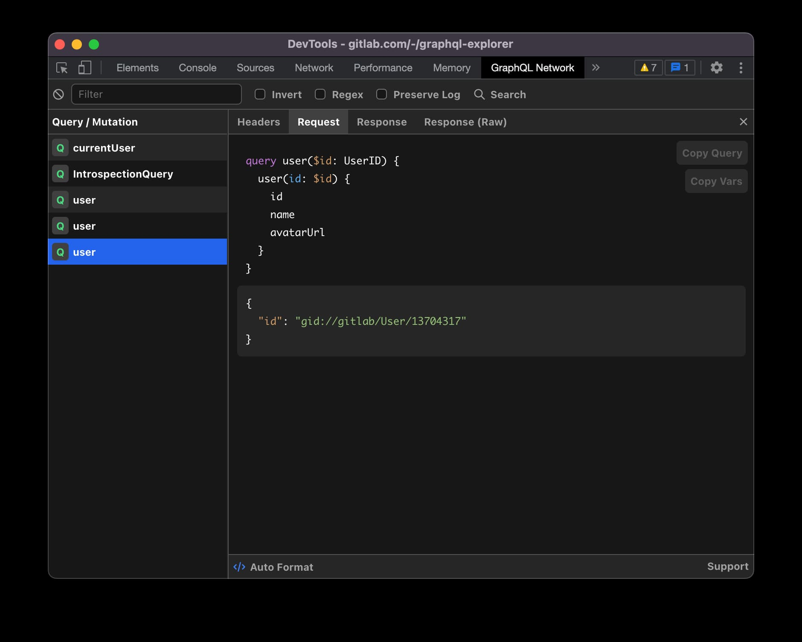

<div align="center">
  <h1>GraphQL Network Inspector</h1>
  <h3>A better network inspector for viewing and debugging GraphQL requests.</h3>
  
  <a href="https://github.com/sponsors/warrenday">
    
  </a>
  <br />
  <br />
</div>



A platform agnostic network inspector specifically built for GraphQL. Clearly see individual GraphQL requests including support for query batching.

[View the full docs](https://www.overstacked.io/docs/graphql-network-inspector)

The plugin is available for both Chrome and Firefox:

1. [Chrome Webstore](https://chrome.google.com/webstore/detail/graphql-network-inspector/ndlbedplllcgconngcnfmkadhokfaaln)

2. [Firefox Addons](https://addons.mozilla.org/en-US/firefox/addon/graphql-network-inspector)

## Features

We provide a number of productivity features to help you debug and understand your GraphQL requests:

- Automatically parse and display requests as GraphQL queries.
- Support for query batching, displaying each query individually.
- Export requests to re-run and share with https://www.graphdev.app

Some shortcuts you may find useful:

- Click any header to copy to clipboard.
- Double click any JWT token header to both decode and copy to clipboard.
- Press `Cmd/Ctrl + F` to open the full search panel.

## Issue with extension not loading

Some users have raised issues with the extension not loading. This may be due to custom settings in your devtools or conflicts with other extensions. If you are experiencing this issue please try the following:

1. Open the devtools and navigate to the settings (cog icon in the top right).
2. Scroll down to the bottom of the "Preferences" tab and click "Restore defaults and reload".

If the issue persists please raise an issue with the details of your browser and we'll try to help.

## Local Development

Install dependencies:

```bash
yarn
```

Run the development server:

```bash
yarn start
```

This will also cache files in the `build` so you can load the directory as an unpacked extension in your browser. Changes will be loaded automatically, however you often have to close and reopen devtools.

## Contribute

PRs are welcome! The best way to do this is to first fork the repository, create a branch and open a pull request back to this repository.

If you want to add a large feature please first raise an issue to discuss. This avoids wasted effort.

## Sponsors

GraphQL Network Inspector is proudly sponsored by:

- The Guild https://the-guild.dev

## License

The MIT License (MIT)

Copyright (c) 2020 GraphQL Network Inspector authors

Permission is hereby granted, free of charge, to any person obtaining a copy
of this software and associated documentation files (the "Software"), to deal
in the Software without restriction, including without limitation the rights
to use, copy, modify, merge, publish, distribute, sublicense, and/or sell
copies of the Software, and to permit persons to whom the Software is
furnished to do so, subject to the following conditions:

The above copyright notice and this permission notice shall be included in all
copies or substantial portions of the Software.

THE SOFTWARE IS PROVIDED "AS IS", WITHOUT WARRANTY OF ANY KIND, EXPRESS OR
IMPLIED, INCLUDING BUT NOT LIMITED TO THE WARRANTIES OF MERCHANTABILITY,
FITNESS FOR A PARTICULAR PURPOSE AND NONINFRINGEMENT. IN NO EVENT SHALL THE
AUTHORS OR COPYRIGHT HOLDERS BE LIABLE FOR ANY CLAIM, DAMAGES OR OTHER
LIABILITY, WHETHER IN AN ACTION OF CONTRACT, TORT OR OTHERWISE, ARISING FROM,
OUT OF OR IN CONNECTION WITH THE SOFTWARE OR THE USE OR OTHER DEALINGS IN THE
SOFTWARE.
